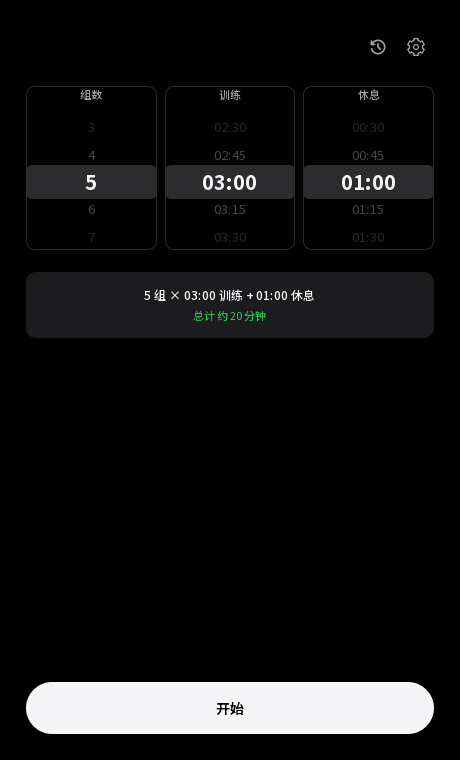
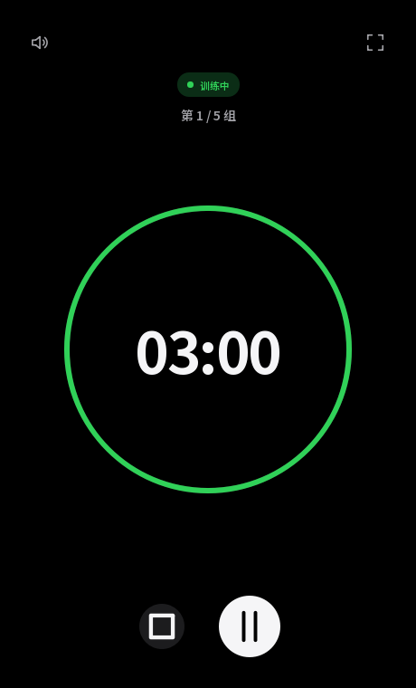
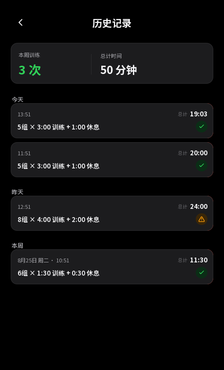
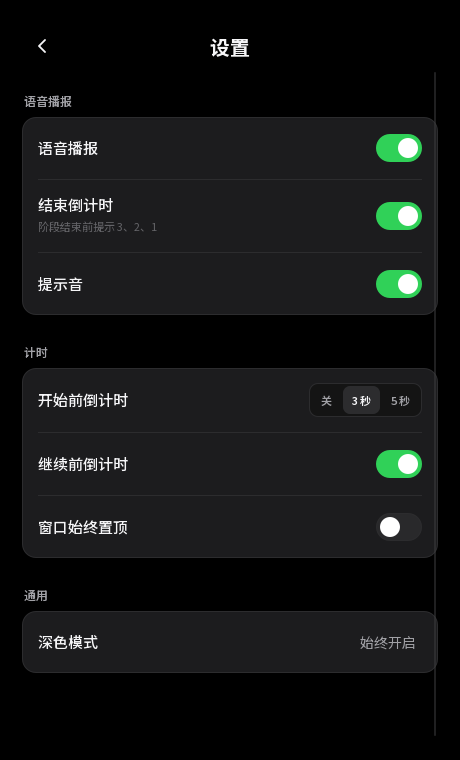

# SetTimer

SetTimer 是一款简洁的 Windows 桌面间歇计时器。滚动选择组数、训练时长和休息时长后即可开始；应用会自动完成准备、训练、休息和下一组切换。

当前版本面向 Windows 10/11，使用 Python、PySide6 和 Qt Quick/QML 构建，不依赖浏览器或本地服务。

## 产品截图

| 主界面 | 训练计时 |
| --- | --- |
|  |  |
| 历史记录 | 设置 |
|  |  |

## 主要功能

- 滚动设置组数、训练和休息时长；时长以 15 秒为间隔，并自动记住上次选择；
- 使用单调时钟计时，界面卡顿或系统时间变化不会造成倒计时漂移；
- 支持暂停、继续、长按结束、全屏和窗口置顶；
- 提供阶段提示音、最后三秒提示和可选中文语音播报；
- 自动保存训练历史，支持本周统计和左滑删除。

## 本地运行

需要 Python 3.10 或更高版本。在 Windows PowerShell 中执行：

```powershell
py -3 -m venv .venv
.venv\Scripts\python -m pip install --upgrade pip
.venv\Scripts\python -m pip install -e ".[dev]"
.venv\Scripts\python -m settimer
```

## 检查与打包

```powershell
# 格式、规范、类型、QML 和测试检查
.\scripts\check.ps1

# 检查、打包并验证成品启动
.\scripts\package.ps1
```

打包结果位于 `dist/SetTimer/`。发布或复制时需要保留整个目录，不能只复制其中的 `SetTimer.exe`。

## 快捷键

| 快捷键 | 操作 |
| --- | --- |
| `Space` | 开始、暂停或继续 |
| `R` | 结束训练，或完成后再来一次 |
| `Esc` | 返回 |
| `F` | 切换全屏 |
| `M` | 静音或恢复声音 |
| `H` | 打开历史记录 |

## 项目结构

```text
src/settimer/
├── application/   应用控制与界面状态
├── domain/        计时状态机与领域模型
├── services/      设置、声音、历史和系统服务
├── ui/            Qt Quick/QML 界面
└── main.py        应用入口

tests/
├── unit/          单元测试
└── integration/   控制器与 QML 集成测试
```

项目采用 MIT License。
